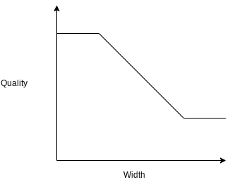

--- 
sort: 6
---

# Image Quality & Options

Image quality is set per-format, using `format_quality`.

## Constant Quality

  _Format:_

  ```yaml
  format_quality:
    (format): 0 <= integer <= 100
    (...)
  ```

  _Example:_

  ```yaml
  format_quality:
    jpg: 75
    png: 65
    webp: 55
  ```

  _Defaults:_ 

  - webp - 50
  - avif - 30
  - jp2 - 30
  - all others - 75

## Variable Quality

  ```yaml
    format_quality: 
      (format):
        (image width): (quality setting)
        (image width): (quality setting) 
  ```

  _Example:_

  ```yaml
    format_quality: 
      jpg:
        1000: 65
        300: 100
  ```

Set a variable image quality, based on image width. Provide exactly 2 image widths and associated
quality settings. Quality will be calculated as follows:

  * For images smaller than the lowest image width, the setting for the lowest width is used. 
  * For images larger than the highest image width, the setting for the highest width is used. 
  * For images in between the 2, the quality setting will be linearly interpolated to some value in
    between.

  

Using this setting, you can get away with more compression on high pixel density screens without
sacrificing image quality for low-density screens. Taking the example settings above:

  * A 1500px image will use a quality of 65.
  * A 200px image will use a quality of 100.
  * A 500px image will use a quality of 90.


  _Format:_

  ```yaml
      (...)
    (...)
  ```

  _Example:_

  ```yaml
  ```

  ```yaml
  ```


