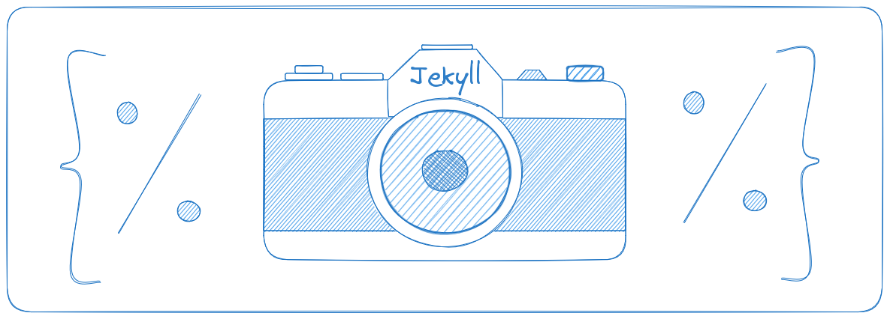

# Jekyll Picture Tag

**Responsive Images done correctly.**

Jekyll Picture Tag automatically builds cropped, resized, and reformatted images, builds several
kinds of markup, offers extensive configuration while requiring none, and solves both the art
direction and resolution switching problems with a little YAML configuration and a simple template
tag.

It's simple to throw a photo on a page and call it a day, but doing justice to users on all
different browsers and devices is tedious and tricky.
[Tedious, tricky things should be automated](https://robert-buchberger.com/blog/2021/responsive_images.html).

## Why use Responsive Images?

**Performance:** The fastest sites are static sites, but if you plonk a 2mb picture of your dog at
the top of a blog post you throw it all away. Responsive images allow you to keep your site fast,
without compromising image quality.

**Design:** Your desktop image may not work well on mobile, regardless of its resolution. We often
want to do more than just resize images for different screen sizes, we want to crop them or use a
different image entirely.

## Why use Jekyll Picture Tag?

**Developer Sanity:** If you want to serve multiple images in multiple formats and resolutions, you
have a litany of markup to write and a big pile of images to generate and organize. Jekyll Picture
Tag is your responsive images minion - give it simple instructions and it'll handle the rest.

## Features

* Generate piles of cropped, resized, and converted image files.
* Generate corresponding markup in several different formats.
* Configure it easily, or not at all.
* Make Lighthouse happy.

## Documentation

<https://rbuchberger.github.io/jekyll_picture_tag/>

## Changelog

<https://rbuchberger.github.io/jekyll_picture_tag/devs/releases>

2.0 and later releases:

* 2.1.3 10 June, 2025
  * Decide whether to call `magick` or `convert` more intelligently. This adds Windows support, without breaking JPT on Ubuntu or other distros that only ship an ancient version of ImageMagick. Thanks to [@MUmarShahbaz](https://github.com/MUmarShahbaz) for [#324](https://github.com/rbuchberger/jekyll_picture_tag/pull/324)
* 2.1.2 13 September, 2024
  * Remove overly specific version spec for ruby-vips - thanks to [@hschne](https://github.com/hschne) for [#313](https://github.com/rbuchberger/jekyll_picture_tag/pull/313)
* 2.1.1 20 July, 2024
  * Don't provide Q setting for PPM images - thanks to [@dichiban](https://github.com/dichiban) for [#309](https://github.com/rbuchberger/jekyll_picture_tag/pull/309)
  * Fix alpha premultiplication - thanks to [@KaarlisCaune](https://github.com/kaarliscaune) for [#302](https://github.com/rbuchberger/jekyll_picture_tag/pull/302)
* 2.1.0 29 January, 2024
  * Check whether the vips CLI is installed before trying to use it. Thanks to [@philrb](https://github.com/philrb) for
    [#299](https://github.com/rbuchberger/jekyll_picture_tag/pull/299)
  * Update minimum required mocha version to maintain compatibility with minitest
* 2.0.4 August 16, 2022
  * Fix backend format support detection for new versions of libvips & imagemagick
* 2.0.3 April 1, 2021
  * Improve backend format support detection
* 2.0.2 March 31, 2021
  * Do not pass a quality argument when generating PNG files.
    * It only works on newer versions of vips, breaking builds when using older
      versions (such as when deploying to netlify.)
    * It's not remarkably useful in the first place.
* 2.0.1 March 31, 2021
  * Select imagemagick deliberately when appropriate, rather than simply rescuing all vips errors
    and trying again. This will stop JPT from suppressing useful vips errors.
* **2.0** March 25, 2021 - [Migration guide](https://rbuchberger.github.io/jekyll_picture_tag/users/notes/migration_2)
  * Switch from ImageMagick to libvips.
    * 🚀🔥🔥**MUCH MORE FASTER**🔥🔥🚀
    * Will still attempt to use imagemagick if libvips cannot handle a
      particular image format.
    * Eliminate the ImageMagick v7 on Ubuntu pain we've been dealing with for so
      long.
  * Require Ruby >= 2.6, support Ruby 3.0
  * Require Jekyll >= 4.0
  * Cropping is changing.
    * We now use the libvips
        [smartcrop function](https://www.rubydoc.info/gems/ruby-vips/Vips/Image#smartcrop-instance_method),
        which does some magic to keep the most useful part of the image.
    * Geometry is renamed to 'crop', and reduced to simple aspect ratios only. (`width:height`)
    * Gravity is gone, replaced by 'keep' which is translated to a libvips
        [interestingness](https://www.rubydoc.info/gems/ruby-vips/Vips/Interesting) setting.
  * Add stock presets and media queries, under the `jpt-` prefix.
  * Add `format_quality` default settings for webp, avif, and jp2.
  * Add image-format-specific write options.
  * Overhaul user input handling; we can now validate inputs and give error
    messages which are less useless. Stronger validation and nicer errors will be added in future
    releases.
  * Drop support for `markup_presets` and `media_presets`. They are now
    officially and only `presets` and `media_queries`.
  * Improve docs with an introductory tutorial and 'how-to' flow.
